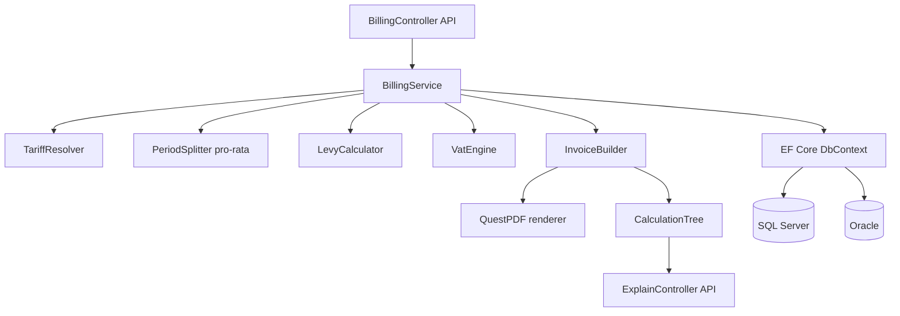

# energy-billing-engine

> C# billing engine for energy customers with Oracle and SQL Server support, traceable invoice calculation trees, and dynamic tariff comparison.


---

## Problem

Calculating an energy invoice is deceptively complex: tariffs change mid-period, contracts start on arbitrary dates requiring pro-rata splitting, network fees and levies are layered on top of the energy price, and VAT applies at different rates. When customers dispute their bill, a billing system must show every input value, every formula, and every intermediate result — not just a final number.

This engine implements end-to-end billing for electricity customers: from meter reading to a printable PDF invoice, with a full calculation trace exposed via API and golden-master tests that lock in correctness against both SQL Server and Oracle databases.

---

## Features

- Model: `Customer`, `Contract`, `Tariff` (base price, energy price, time-of-use), network fees, levies, billing period
- Pro-rata calculation for mid-period price changes and contract start/end
- Meter reading based and interval (15-min) based billing with VAT
- Invoice generation as PDF (QuestPDF community license)
- Invoice correction (Storno) and cancellation flow
- Golden-master tests with fixed expected invoices, run against both SQL Server and Oracle via Testcontainers
- "Explain my bill": every invoice line exposes a traceable calculation tree (inputs → formula → result)
- Dynamic tariff: hourly synthetic spot prices vs. fixed tariff savings comparison per customer

---

## Innovation

_TODO: expand after implementation_

---

## Architecture



---

## Quick Start

```bash
# SQL Server
docker compose --profile sqlserver up -d
dotnet run --project src/EnergyBillingEngine.Api -- --database sqlserver

# Oracle
docker compose --profile oracle up -d
dotnet run --project src/EnergyBillingEngine.Api -- --database oracle
```

Generate an invoice:

```bash
curl -X POST http://localhost:5002/api/billing/invoices \
  -H "Content-Type: application/json" \
  -d '{"customerId":"c1","periodStart":"2024-01-01","periodEnd":"2024-01-31"}'
```

Explain it:

```bash
curl http://localhost:5002/api/billing/invoices/{id}/explain
```

---

## Domain Glossary

| German | English | Explanation |
|--------|---------|-------------|
| Jahresverbrauchsabrechnung | Annual consumption invoice | Yearly settlement based on actual vs. advance payments |
| Abschlag | Advance payment | Monthly instalment paid before annual settlement |
| Netzentgelt | Network fee | Fee for using the electricity grid |
| Konzessionsabgabe | Franchise fee | Fee paid to municipalities for grid right-of-way |
| EEG-Umlage | Renewable energy surcharge | Levy funding renewable energy feed-in tariffs |
| Storno | Cancellation / reversal | Formal correction of an already-issued invoice |
| Grundpreis | Base price / standing charge | Fixed monthly amount independent of consumption |
| Arbeitspreis | Energy price | Price per kWh consumed |

---

## Testing

```bash
dotnet test
```

Coverage highlights:
- Golden-master invoices: computed values match expected JSON snapshots
- Pro-rata: partial month with mid-period price change produces correct day-accurate split
- DST: billing period spanning the March clock change includes the correct interval count
- Oracle vs SQL Server: identical results from both providers

---

## Design Decisions

See `docs/adr/` for Architecture Decision Records.

---

## Roadmap / Next Steps

- SEPA direct debit XML generation
- Multi-commodity billing (gas)
- Integration with `edifact-energy-parser` for MSCONS-driven billing

---

## Kurzfassung auf Deutsch

Diese Billing-Engine berechnet Energierechnungen für Endkunden nach den typischen Strukturen des deutschen Energiemarkts: Grundpreis, Arbeitspreis, Netzentgelt, Konzessionsabgabe, EEG-Umlage und Mehrwertsteuer. Pro-rata-Aufteilungen für Preisänderungen und Vertragswechsel im Abrechnungszeitraum werden tagesgenau berechnet. Jede Rechnungszeile ist mit einem vollständig rückverfolgbaren Berechnungsbaum verknüpft, der über eine eigene API abrufbar ist. Rechnungen werden als PDF mit QuestPDF generiert; Stornierungen und Korrekturrechnungen werden im Workflow abgebildet. Ein Dynamiktarif-Vergleich stellt stündliche Spotpreise dem Festpreistarif gegenüber. Die Tests laufen gegen SQL Server und Oracle über Testcontainers und verifizieren identische Ergebnisse auf beiden Plattformen.
